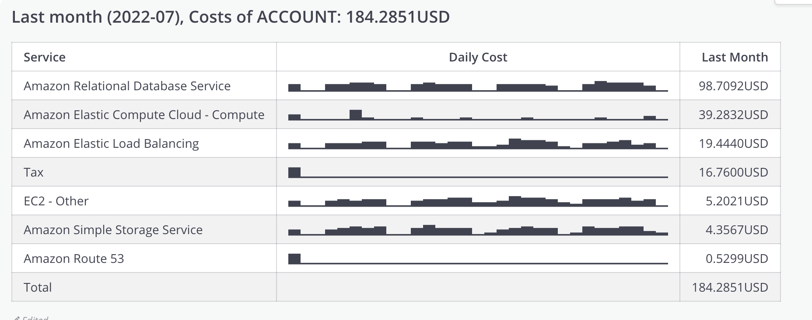

# aws-cost-to-mattermost
This source is written to send AWS cost to mattermost that using AWS Serverless Application Model (SAM) to deploy.In source, @aws-sdk/client-cost-explorer (AWS SDK for JavaScript v3) is used to get details of costs last month

# Install
1. Install SAM
2. Configure AWS profile to deploy source to Lambda Function
3. Configure environment parameter MATERMOST_HOOK in template.yaml. The event default is ```(cron(30 2 1 * ? *)```, edit if you want other schedule.
4. run ```npm install ``` in ./src
5. run ```sam deploy --guilded```